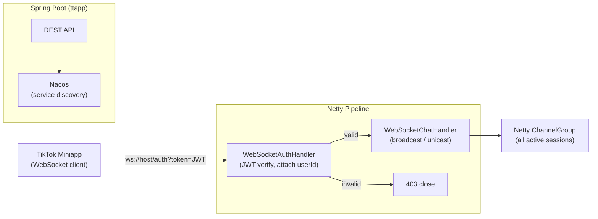

# TT_APP_2025_BackEnd · Netty WebSocket Chat Backend

> **A high-concurrency WebSocket chat backend for the TikTok (抖音) 2025 AI Competition miniapp — Netty NIO pipeline with JWT authentication at connection time.**
>
> 抖音 2025 AI 创变者大赛小程序后端，Netty 异步 NIO 驱动的 WebSocket 聊天室，连接建立时即完成 JWT 身份验证，Spring Boot 集成 Nacos 服务注册。

[English](#english) · [中文](#中文)


---

<a id="english"></a>

## Architecture



## Quickstart

```bash
# 1. Start Nacos (optional for local dev, disable discovery in config)
# 2. Configure application.yml (port, nacos.server-addr)
mvn spring-boot:run

# WebSocket endpoint
ws://localhost:PORT/ws?token=<JWT>
```

## Technical Highlights

<details>
<summary><b>Netty async NIO vs. thread-per-connection</b></summary>

- **S**: Traditional servlet-based WebSocket (e.g., Spring WebSocket) allocates one thread per connection. At hundreds of concurrent chatroom users, thread context-switch overhead degrades throughput.
- **A**: `EchoServer` bootstraps a Netty `NioEventLoopGroup` with a bossGroup (1 thread, accept) + workerGroup (N threads, I/O). Each channel is handled asynchronously; no thread blocks waiting on a socket.
- **R**: Handles many concurrent WebSocket connections on a small thread pool; scales horizontally by increasing workerGroup threads.
</details>

<details>
<summary><b>JWT verification in the Netty pipeline before upgrade</b></summary>

- **S**: WebSocket upgrade happens over HTTP; if auth is deferred to the WebSocket layer, an unauthenticated client can already hold an open channel.
- **A**: `WebSocketAuthHandler extends SimpleChannelInboundHandler<FullHttpRequest>` intercepts the HTTP upgrade request, extracts the JWT from the URI query param, verifies with `Algorithm.HMAC256`, and attaches the `userId` to the channel's `AttributeKey`. Invalid tokens close the channel with a 403 before the upgrade completes.
- **R**: Zero unauthenticated WebSocket sessions; auth logic isolated to one pipeline stage.
</details>

## Repo Layout

```
nettyServer/
└── src/main/java/com/seal/nettyserver/
    ├── handler/
    │   ├── WebSocketAuthHandler.java   JWT verify + userId attach
    │   └── WebSocketChatHandler.java   message broadcast/unicast
    ├── initializer/WebSocketInitializer.java  pipeline assembly
    └── server/EchoServer.java          Netty bootstrap

ttapp/
└── ttapp_base/   Spring Boot REST + Nacos integration

src/   Spring Boot entry (NettyDemoApplication)
```

## Roadmap

- [x] Netty WebSocket server with NIO event loop
- [x] JWT auth at HTTP upgrade (HMAC256)
- [x] Nacos service registration
- [ ] Room-based channel groups (multi-room support)
- [ ] Message persistence (Redis pub/sub or MongoDB)
- [ ] Reconnect with session resume

---

<a id="中文"></a>

## 中文速读

- **是什么**：抖音 2025 竞赛小程序 WebSocket 聊天后端，Netty NIO 事件驱动，HTTP 升级阶段即做 JWT 验证，Spring Boot + Nacos 服务注册。
- **亮点**：`WebSocketAuthHandler` 在 WebSocket 握手前完成 JWT 校验，无效 token 403 关闭，零未认证会话；Netty bossGroup/workerGroup 分离连接接受与 I/O 处理。
- **运行**：配置 Nacos 地址 → `mvn spring-boot:run`，客户端连接 `ws://host/ws?token=JWT`。

## License

MIT © [Seal-Re](https://github.com/Seal-Re)
